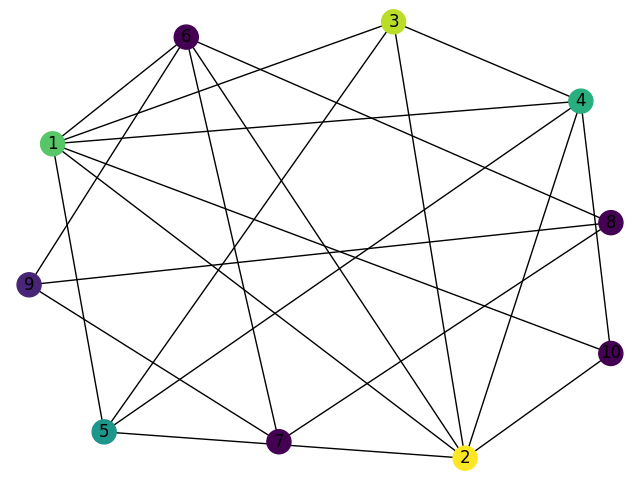
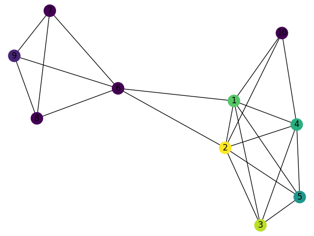
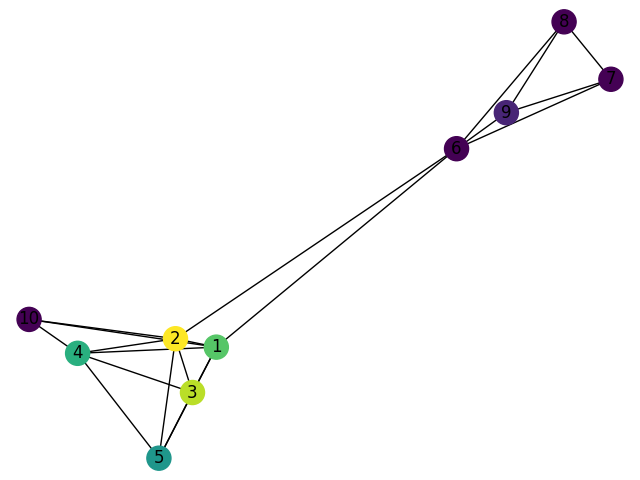
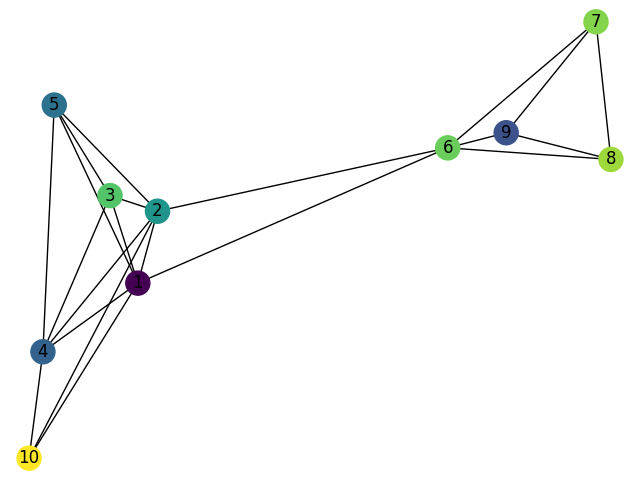
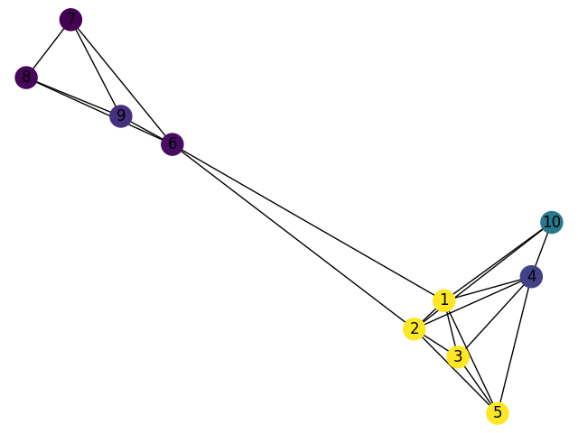

# Weighted Kcliquing for community detection
A simple program using weighted  K-cliquing Community Detection to produce colored network graphs with nodes clustered by their community.

# Introduction

Within nature and society there exists complex systems that can be represented by networks of connections detailing complicated interactions between the systems individual sub components. One key question within the sciences, particularly computer science, is how one might interpret sub-structures, otherwise known as communities, within these networks and how their associated interactions influence the overall ‘global’ system. Due to this their actual identification within the global system, how one might determine a true community from a meaningless connection, is crucial to actually understanding how the overall network operates. The problem explored in this project will aim to answer the question of how one might develop an effective method of determining ‘communities’ within a complex system and how its individual sub-components contribute to these ‘communities’ along with interacting or overlapping with ‘foreign’ communities.

Earlier research and techniques proved successful in determining distinct separate communities within the network but had several shortfalls. The primary issue was that though these networks did contain the identified communities it failed to account for the significant overlap between communities and their proper composition as varied nodes rather than solid ‘blocks’. The majority of these networks and sub-structures were composed of clustered nodes whose ‘communities’ would directly overlap nodes within other communities and rarely formed discrete boundaries. This misrepresentation was noted specifically within the paper(6 k-clique Palla_Uncovering the overlapping community structure of complex networks in nature and society) I chose to research as they wished to correct this inaccuracy.

For my own personal implementation I’ll be attempting to replicate the methods as indicated by the researchers with several slight modifications. Firstly the researchers used binary graphs for their implementation which negates direction. Though this does simplify the method it doesn’t allow the researchers to indicate more direct interaction between nodes. For instance, if we wished to graph how certain social communities interacted with each other it'd be useful to have the graph indicate which individuals initiated ‘first contact’. Sent the initial friend request on facebook as a contemporary example. 

# Implementation

Initially my choice for library was focussed on Plotly as my interactions and tests showed that it was promising and capable of visualizing everything fairly easily. After further work with it though I noticed that it was essentially redressing another library, networkx, which if used on its own in conjunction with matplotlib was even more lightweight and focused purely on network graphs which helped simplify my process.

The Custom Data set I designed was made to represent the personal connections between myself and several different friends along with how they have interacted recently and the sub communities that exist between all of them. This was done by first determining the individuals that would be contained with the set and then polling each of them on how many interactions they had with all other members of the set over the last 3 weeks. Since this was fairly labour intensive I kept the set small with only a total of 10 individuals and their number of interactions with each other individual. Since each person can therefore have a total of 9 “connections” or edges with other nodes our total network complexity should at most be 90 total edges. If an interaction did not occur the nodes representing individuals within the network will not share an edge.

Nodes determined to be within the same community will share a color with nodes existing between a transition zone, belonging to both communities, having a mix of both. Communities are themselves defined as several fully complete subgraphs that share many if not most of their nodes. More precisely we define them as the union of k-cliques, complete subgraphs of k size, that can be reached through an k-clique that shares k-1 nodes.

Within my initial proposal I speculated on two attributes that would improve the overall effectiveness of k-cliques, one was to use a directional graph rather than a binary to represent social introductions and the other was to assign weighted totals to each edge to track the number of interactions. Though tracking edge weights did not prove to be an issue I encountered issues continually tracking who initiated the interaction and how to best scale its influence. For the edges the weight was linearly tracked to the number of interactions which produced a reasonable approximation of two nodes influence on each other and how their separate communities interacted, no such clear method existed for introducing a directional vector and since I did not wish to skew results I have decided to not incorporate it as a feature in this project.

Fig 1. Initial Rendering of Data Set.

My algorithm worked by first drawing all the nodes and edges onto the graph as defined by the array Data_Set. After this all K_Cliques of the graph were found using a variable K-size that can be adjusted and after that these cliques were searched for overlap. In the original paper overlap was determined using a Matrix but in my case I tagged each community with a unique color, with nodes color being a combination of these community colors. Therefore communities with similar communities would find themselves sharing similar colors, this was a simplification I had to make due to time.

This was also used in tandem with a weight factor applied to each edge that corresponds to the number of interactions each node had with the other that I applied using the default weight property in the networkx framework.

# Experimental Results

Overall my results for the algorithm were very promising. Initially without applying weights the algorithm did a sufficient job of coloring related nodes with similar shades, which indicated to me that it successfully identified shared communities. This was reconfirmed when I examined the results against my own personal understanding of the relationships. This initial graph can be seen below.

In this instance I generated the K-Cliques using a k-size of 4.

Fig 2. Without Weights

Though this was sufficient in identifying shared sub communities it did little to indicate closer bonds between individual nodes and how that might influence their shared communities. To test this I added the weight factor that linearly trended to their number of historic interactions, so two people who interacted 30 times would share an edge of weight 30. The results of this can be seen below in Fig 4. These results were able to confirm my hypothesis that adding edge weights would define communities more strongly. As can be seen in Fig. 4 the introduction of weighted edges allowed for the communities to more closely cluster revealing underlying structure.

For instance I personally know that nodes 1,2 and 3 are all roommates hence the close clustering due to heavy weighted edges from constant interactions. This was a substructure that was not clearly visible without the weights as nodes 4 and 5 looked as if they could have also been roommates. SImilarly nodes 4 and 10 are roommates along with 6 and 9. All these sub structures among the wider network would have been easily missed without the weights but become fairly evident with them applied.

Fig 3. With Weight

The only other factor within the experimental results worth mentioning relates to the size of the K-cliques. Initially I produced multiple visualizations using a loop and an incrementing K_Size value to find the best clique size for this particular graph, which happened to be 4, but further experimentation to find a general solution to the ideal k_size would be worth investigating. Below I have included further figures showing the different clusterings and communities depending on K_size.  Otherwise I feel confident that the research performed under the project has further solidified the advantage of K_Cliquing for community finding along with the advantage of using weighted edges to reveal further sub-structures within communities. 

Fig 4. K_Size = 2

Fig 5. K_Size = 3

